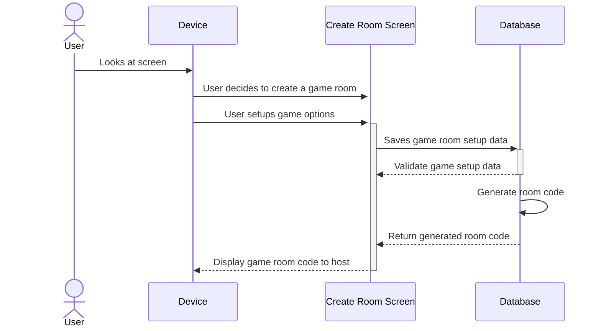
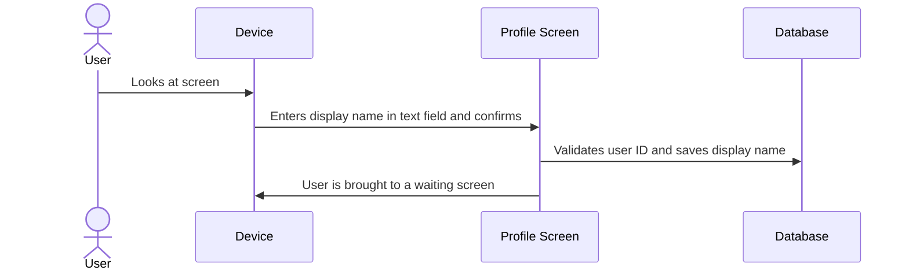
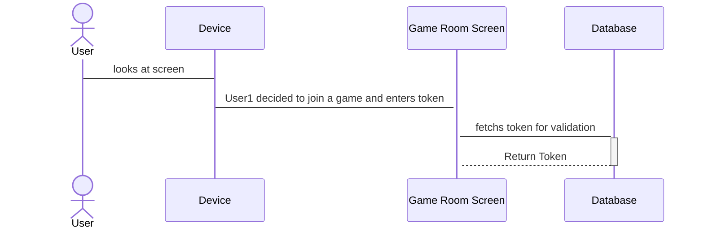

# Use-case descriptions

## Use Case 1: Accessibility & AAC - Non AAC device mode

### User does not have an AAC device and wants to use an on-screen keyboard
1. User indicated they do not have an AAC device during AAC mode 
2. User is notified that a keyboard layout will be available on their screen during gameplay

## Use Case 2: Accessibility & AAC - AAC device mode

### User wants to use an AAC device
1. User indicates they have an AAC device
2. User is instructed to connect their AAC device via Bluetooth or USB
3. User is notified on the host's screen to verify the AAC device input connection
4. User successfully connects their AAC device
5. User is notified on the host's screen that it will accept input from the AAC device

## Use Case 3: Player Customization - New player profile

### User wants to set up a new player profile and interaction mode

1. User successfully joins a game room
2. User enters their display name in an input field
3. User selects whether they are using an AAC device or a non-AAC device
4. User clicks a "Done" button

## Use Case 4: Room Management - Setting up a new room

### User wants to start a new game room

1. User opens the game on a device
2. User clicks the "Create a Game Room" button
3. User selects a story type
4. User selects a grade level 
5. User selects the number of players
6. User clicks the "Start" button

## Use Case 5: Room Management - Player Joins a Game through the Join Screen

### User wants to join the game the host has made

1. User clicks on the "Join Game" button
2. User inputs the code displayed on the host's screen into the input box
3. User inputs the correct code and is brought to a lobby with all the other players who are participating in the game session

## Use Case 6: Game Mechanics - Wrong answer

### User guesses an incorrect answer

1. User is in a game session using their device
2. User is prompted with a storyline containing a missing word
3. User types or says a word that is an incorrect answer
4. User clicks the "Confirm" button
5. User is notified that their answer was incorrect and is prompted to try again
6. User is prompted with the same storyline

## Use Case 7: Game Mechanics - Correct answer

### User guesses a correct answer

1. User is in a game session using their device
2. User is prompted with a storyline containing a missing word
3. User types or says a word that is the correct answer
4. User clicks the "Confirm" button
5. User is notified that their answer was correct
6. User is notified that its next player's name turn and waits

## Use Case 8: Gameplay Mechanics - Retry Mechanism

### User wants to retry the question because they got it wrong 

1. User has selected the wrong answer to the question
2. User receives feedback explaining why their answer was incorrect
3. User clicks a "Retry" button
4. User is given the same question again with the same answer choices 
