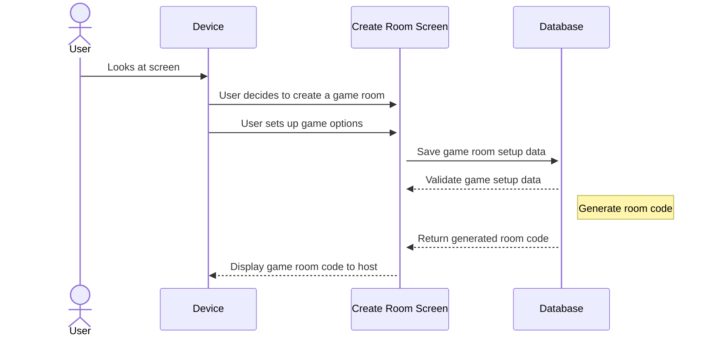
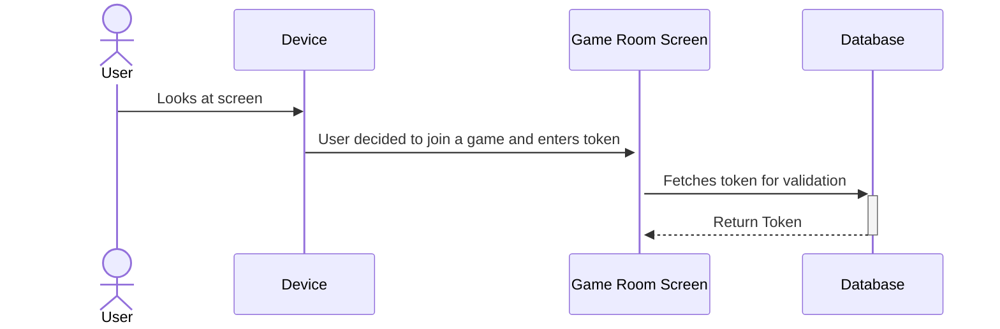
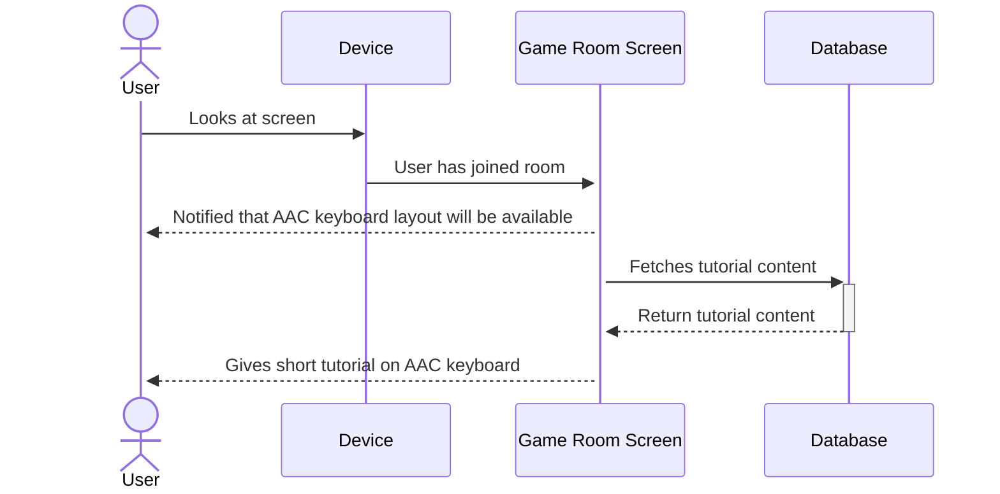
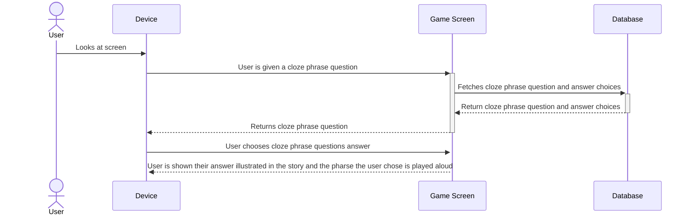
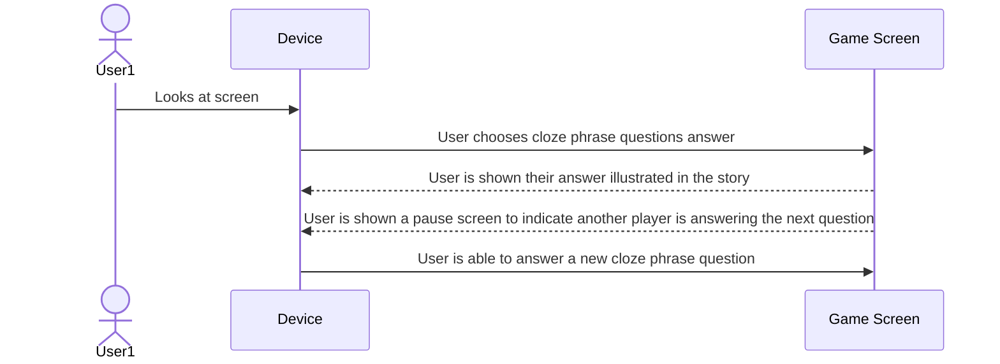
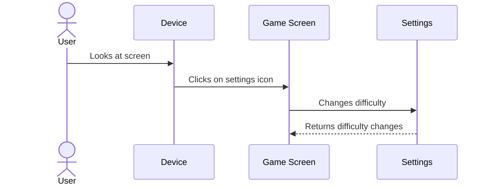

# Use-case Descriptions

## Use Case Sequence Diagrams

## Use Case 1: Room Management - Setting up a new room

[User wants to start a new game room](../requirements/use-case-descriptions.md#user-wants-to-start-a-new-game-room)

1. User opens the game on a device
2. User clicks the "Create a Game Room" button
3. User selects a story type
4. User selects a grade level
5. User selects the number of players
6. User clicks the "Start" button

Figure 1

## Use Case 2: Room Management - Player Joins a Game through the Join Screen

[User wants to join the game the host has made](../requirements/use-case-descriptions.md#user-wants-to-join-the-game-the-host-has-made)

1. User clicks on the "Join Game" button
2. User inputs the code displayed on the host's screen into the input box
3. User inputs the correct code and is brought to a lobby with all the other players who are participating in the game session

Figure 2
## Use Case 3: Accessibility & AAC

[Users utilize a built-in AAC keyboard](../requirements/use-case-descriptions.md#users-utilize-a-built-in-aac-keyboard)

1. User joins a room.
2. User is notified that a keyboard layout will be available on their screen during gameplay
3. User is given a short tutorial on the AAC keyboard.
4. User click a button to indicate readiness to "Start" the game.

Figure 3
## Game Mechanics

## Use Case 4: Cloze Phraze Education - User Chooses an Answer

[User Chooses an Answer](../requirements/use-case-descriptions.md#user-chooses-an-answer)

1. User is in a game session using their device
2. User is prompted with a storyline containing a cloze pharse question
3. User chooses an answer choice
4. User clicks the "Confirm" button
5. User is shown their story illustrated
6. User is prompted with another sentence in the story 

Figure 4
## Use Case 5: Collaboration - Users Take Turns Answering a Question

[Users Take Turns Answering a Question](../requirements/use-case-descriptions.md#users-take-turns-answering-a-question)

1. User is in a game session using their device
2. User chooses an answer choice
3. User is shown their story illustrated
4. User is prompted with a pause screen indicating another player is answering 
5. Second player answers 
6. User is now able to answer a new cloze phrase question

Figure 5
## Use Case 6: Difficulty Scaling - User Wants to Change Difficulty

[Users Wants to Change From Easy Mode to Medium Mode](../requirements/use-case-descriptions.md#users-wants-to-change-from-easy-mode-to-medium-mode)

1. User is in a easy mode game session using their device
2. User decides to change to medium mode game session
3. User clicks on the setting button
4. User is shown different settings options and clicks change difficulty button 
5. User changes to medium difficulty 
6. User is now able to answer a medium difficulty cloze phrase question

Figure 6
