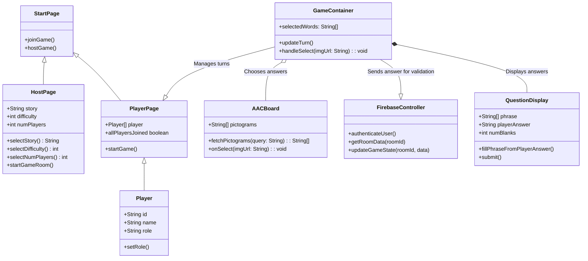
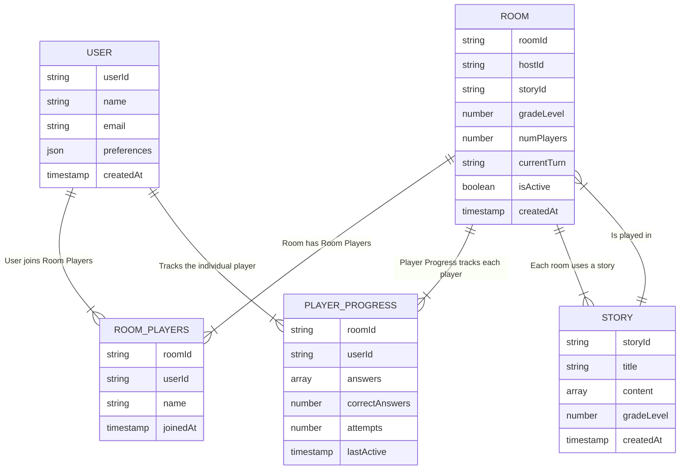
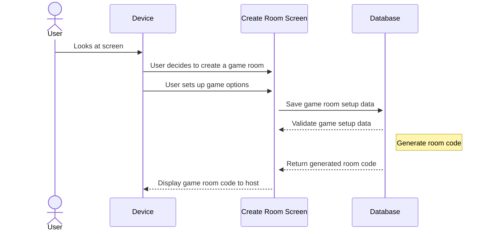
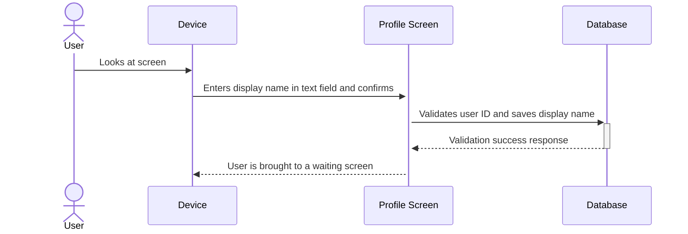
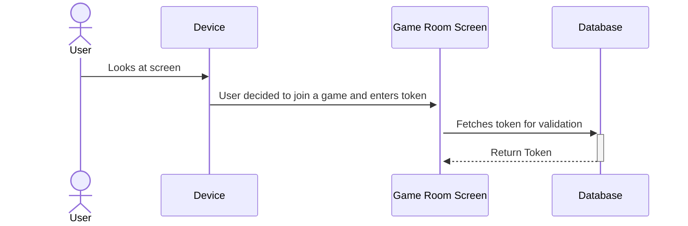
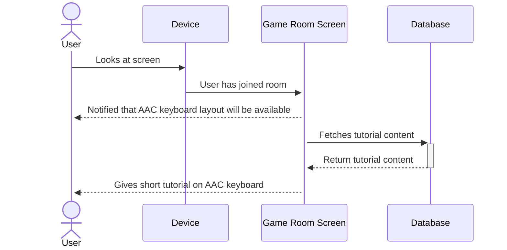
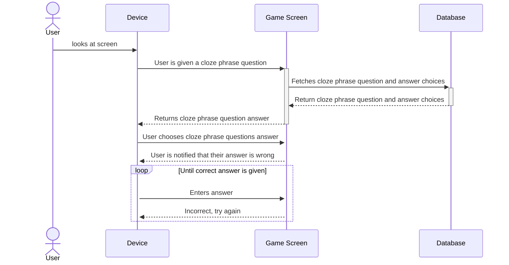
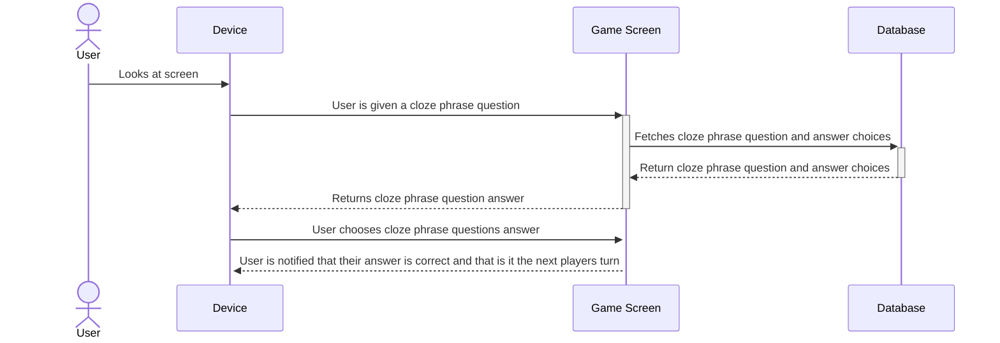
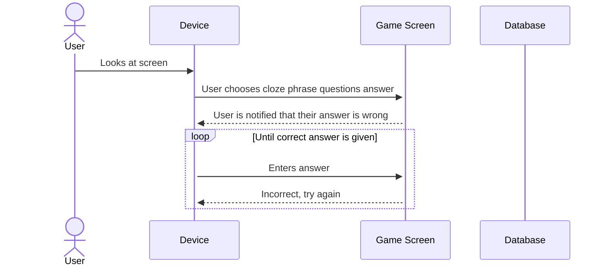

**Purpose**

The architecture of StoryQuest is based on a client-server model using modern web technologies. The front-end client is built 
with React and Next.js, while the back-end leverages Firebase for real-time database synchronization, authentication, and 
accessible experience for AAC users, incorporating symbol-based communication and text-to-speech capabilities. 

**Requirements**
## Components Description
### Client (Front-End)
The client is a React application built with Next.js framework, offering server-side rendering for improved performance and SEO. It provides 
the user interface that students interact with, including AAC features, story navigation, and room management.

**Technologies Used:**
- React (UI components)
- Next.js (Routing and server-side rendering)
- Tailwind CSS (Responsive and accessible styling)
- Framer Motion (Smooth animations for kids)
- ShadCN/UI (Pre-built, accessible UI components)
- TypeScript (Ease of use in JavaScript)

**Responsibilities:**
- Display the homepage with options to create or join a room
- Render stories and fill-in-the-blank activities
- Handle AAC interactions (symbol grids, text-to-speech)
- Communicate with Firebase for real-time updates and authentication
- Provide responsive design for tablets and desktops

**Interface:**
- Firebase SDK: The client uses the Firebase JavaScript SDK for real-time communication with the back-end.
- AAC Symbol Library (ARASAAC): Provides visual symbols for communication

### Server (Back-End)
The back-end services are managed by Firebase, which provides real-time database capabilities, authentication, and cloud functions for game logic. 
This architecture minimizes server management overhead while offering scalability and performance.

**Technologies Used:**
- Firebase Authentication: For secure room joining and session management.
- Firebase Firestore: A NoSQL real-time database to store game data, room information, and group progress.
- Firebase Cloud Functions: To handle server-side logic like validating game answers and managing game state.

**Responsibilities:**
- Manage session tokens.
- Handle real-time game state updates across all players.
- Store and retrieve stories, game progress, and player data.
- Execute server-side logic for game validation (like answer validation)

**Interfaces:**
- Client Requests: The client interacts with the server via Firebase SDK calls, which handle real-time data synchronization.
- Cloud Functions Triggers: Automatically execute server-side logic when certain conditions are met (like when a new answer is submitted)

### Class Diagrams

*Figure 1: Class diagram showing interaction between classes within StoryQuest*

This class diagram shows the relationships between different components in the StoryQuest system.

The **Player** class encompasses all users who interact with the system. They are subdivided into 'student' and 'host'
roles within the class.

#### Room Management
The system has a **StartPage**, a **HostPage**, and a **PlayerPage**. These components make up room management in the game. In **StartPage**, the **Player**
has the option to join an existing game, or host a game. If a **Player** chooses to join a game, they are led to the **PlayerPage**. This is
a waiting room that tracks the players that have entered a game and can trigger the start of the game. If a **Player** instead chooses
to host a game, they are led to the **HostPage**. This is a page with administrative control over settings of the game, like story, difficulty, and number of players
along with the ability to begin hosting.

#### GamePlay
Once the game is started, the **GameContainer** takes control. It contains a **QuestionDisplay**, which displays selected answer choices and source material for questions,
and the **AACBoard**, which contains an self-contained AAC word bank to select answers from. Once a **Player** selects an answer on the **AACBoard** it is displayed on the **QuestionDisplay** and
sent to **FirebaseController** to be sent to Firebase for validation (i.e. if a player selects 'Apple' from the offered choices, the image of an 'Apple' is sent back to be added to the scene in
**QuestionDisplay**). The game continues until the end of the story.

### Database
**Users:**
- userId: Unique identifier
- name: Player's name
- preferences: AAC settings, favorite symbols

**Rooms:**
- roomId: Unique code for room access
- hostId: The player who created the room
- players: List of players in the room
- currentTurn: Tracks whose turn it is
- storyProgress: Current state of the story

**Stories:**
- storyId: Unique ID
- gradeLevel: Target grade level (1st-3rd)
- content: Story text with blanks

**Responsibilities:**
- Persist user data and game state
- Support real-time synchronization of game progress
- Allow dynamic story loading and AAC customization

**Interfaces:**
- Firebase Firestore SDK: Used by both client and server to read/write data in real-time
- Cloud Functions: Perform automated updates (like saving game progress)

### Database Design
Here is the database section with an Entity-Relationship Diagram (ERD) and a table design for StoryQuest. 
Since we are using FireBase Firestore, which is a NoSQL database, the structure will be document-based, 
but we can still represent it in a relational style for clarity.

Entities and Relationships:

- User represents a player. 
- A Room is hosted by One user but can have multiple users (as in players). 
- A room is then associated with one story. 
- Each user in a room has a corresponding playerProgress.

**Entity-Relationship Diagram**

*Figure 2: An entity-relationship diagram showing interactions within the database*

**Table Design**

Here is how the data would be structured in Firestore. Though Firestore is a NoSQL database, this relational layout helps clarify the relationships.

**Users Collection**
| Field | Type | Description |
| ----- | ---- | ----------- |
| userId | String | Unique Id (Firebase Auth UID) |
| name | String | Player's display name |
| preferences | Map | AAC preferences |
| createdAt | Timestamp | Account creation date |

**Rooms Collections**
| Field | Type | Description |
| ----- | ---- | ----------- |
| roomId | String | Unique code for room access |
| hostId | String | User ID of the room host |
| storyId | String | ID of selected story |
| difficulty | Number | Difficulty level selected for the room |
| numPlayers | Number | Number of players (1-4) |
| currentTurn | String | User Id of player whose turn it is |
| createdAt | Timestamp | Room creation date |
| isActive | Boolean | Indicates if the game is in progress | 

**RoomPlayers Subcollection (within rooms)**
| Field | Type | Description |
| ----- | ---- | ----------- |
| userId | String | User Id of the player |
| name | String | Player's display name |
| joinedAt | Timestamp | Time when the players joined the room |

**Stories Collections**
| Field | Type | Description |
| ----- | ---- | ----------- |
| storyId | String | Unique id for the story |
| title | String | Title of the story |
| content | Array | Story text with blanks marked |
| difficulty | Number | Intended difficulty level |
| createdAt | Timestamp | Date when the story was added |

**PlayerProgress Subcollection (within Rooms)**
| Field | Type | Description |
| ----- | ---- | ----------- |
| userId | String | User Id of the player |
| answers | Array | List of the answers submitted by the player |
| correctAnswers | Number | Total correct answers by the player |
| attempts | Number | Total attempts made |
| lastActive | Timestamp | Last time the player interacted |

---

## Use Case Sequence Diagrams

## Use Case 1: Room Management - Setting up a new room

## Use Case 2: Player Customization - New player profile

## Use Case 3: Room Management - Player Joins a Game through the Join Screen

## Use Case 4: Accessibility & AAC

## Game Mechanics

## Use Case 5: Wrong answer

## Use Case 6: Correct answer

## Use Case 7: Retry Mechanism

