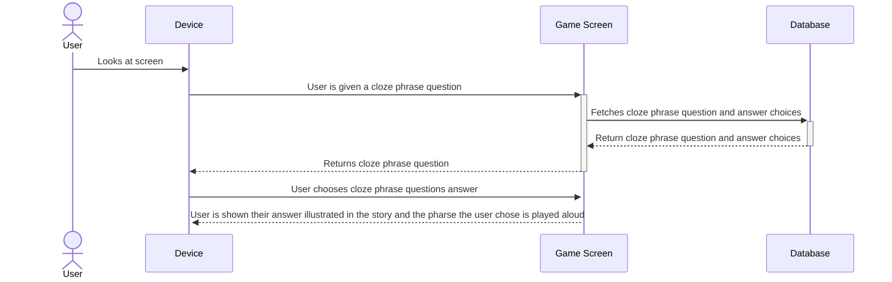
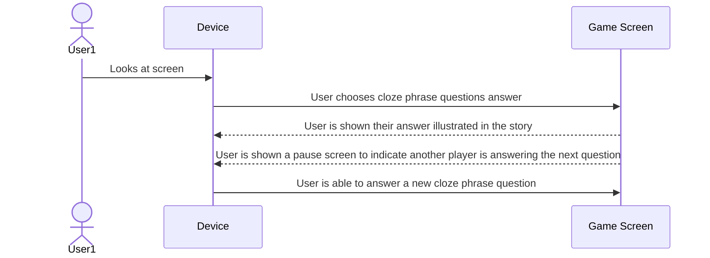
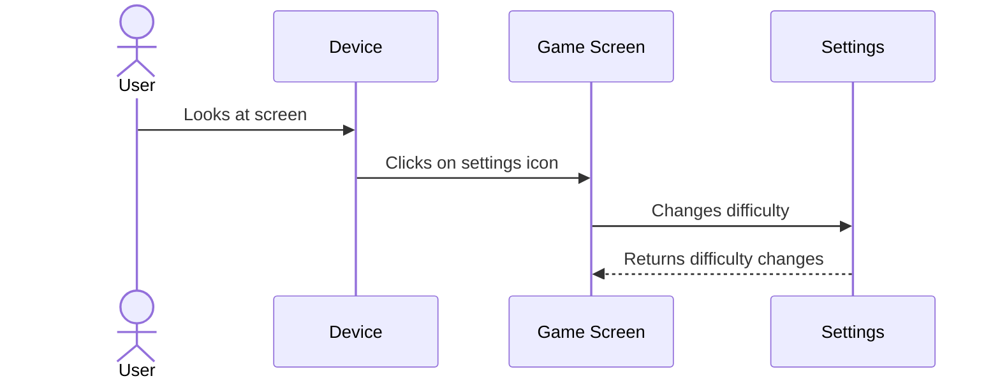

**Purpose**

The front-end client is built 
with React and Next.js, while the back-end leverages Firebase for real-time database synchronization, authentication, and 
accessible experience for AAC users, incorporating symbol-based communication and text-to-speech capabilities. 

## Components Description
### Client (Front-End)
The client is a React application built with Next.js framework, offering server-side rendering for improved performance and SEO. It provides the user interface that students interact with, including AAC features, story navigation, and room management.

**Technologies Used:**
- React (UI components)
- Next.js (Routing and server-side rendering)
- Tailwind CSS (Responsive and accessible styling)
- Framer Motion (Smooth animations for kids)
- ShadCN/UI (Pre-built, accessible UI components)
- TypeScript (Ease of use in JavaScript)

**Responsibilities:**
- Display the homepage with options to create a profile, create, or join a room.
- Render stories and cloze-phrase questions
- Handle AAC interactions (symbol grids, text-to-speech)
- Communicate with Firebase for real-time updates and authentication
- Provide responsive design for tablets and desktops

**Interface:**
- Firebase SDK: The client uses the Firebase JavaScript SDK for real-time communication with the back-end.
- AAC Symbol Library (ARASAAC): Provides visual symbols for communication

### Server (Back-End)
The back-end services are managed by Firebase, which provides real-time database capabilities, authentication, and cloud functions for game logic. 
This architecture minimizes server management overhead while offering scalability and performance.

**Technologies Used:**
- Firebase Authentication: For secure room joining and session management.
- Firebase Firestore: A NoSQL real-time database to store game data, room information, and group progress.
- Firebase Cloud Functions: To handle server-side logic like validating game answers and managing game state.

**Responsibilities:**
- Manage session tokens.
- Handle real-time game state updates across all players.
- Store and retrieve stories, game progress, and player data.
- Execute server-side logic for game validation (like answer validation)

**Interfaces:**
- Client Requests: The client interacts with the server via Firebase SDK calls, which handle real-time data synchronization.
- Cloud Functions Triggers: Automatically execute server-side logic when certain conditions are met (like when a new answer is submitted)

### Class Diagrams

*Figure 1: Class diagram showing interactions between classes within StoryQuest*

This class diagram shows the relationship between different components in the StoryQuest system.

### Player Management
The **Player** class encompasses all users who interact with the system. Each player
has an id, name, and a role, which can be either 'student' or 'host'. The setRole() function 
assigns a role to a player based on whether they are joining a game or starting a game.

#### Room Management
The system has a StartPage, HostPage, and a PlayerPage, all of which handle room
management and game setup.
- StartPage: This is the initial landing page where a Player can choose to either 
join an existing game or host a new one. The functions include:
    - joinGame(): Allows a player to enter an active game session.
    - hostGame(): Redirects the player to the HostPage to configure a new game session.

- HostPage: This page provides administrative controls for setting up a new game. It 
allows the host to define key game settings, such as:
    - selectStory(): Chooses a story template for the game.
    - selectDifficulty(): Sets the level of difficulty (easy, medium, or hard).
    - selectNumPlayers(): Specifies how many players can join the game (4 max).
    - startGameRoom(): Initializes the game session and transitions to gameplay mode.

- PlayerPage: This acts as a waiting room where players gather before the game begins.
    - player[]: An array that holds all players currently in the game.
    - allPlayersJoined: A boolean that checks if all expected players have joined.
    - startGame(): Triggers the transition from the lobby to gameplay when all players are ready.

#### Game Flow Summary

1. The host sets up the game in HostPage.
2. Players join a room via StartPage.
3. Players wait in PlayerPage until the game starts.
4. The game begins under GameContainer, displaying a phrase with blanks to fill.
5. Players take turns selecting answers from the AACBoard.
6. The selected word is displayed in QuestionDisplay and sent through FirebaseController.
7. The game continues turn-by-turn until the story is complete.

### Database
**Users:**
- userId (PK): Unique identifier
- name: Player's name
- preferences: AAC settings, favorite symbols

**Rooms:**
- roomId (PK): Unique code for room access
- hostId (FK from the Users table): The player who created the room
- players: List of players in the room
- currentTurn (FK from the users table): Tracks whose turn it is
- storyProgress: Current state of the story

**Stories:**
- storyId (PK): Unique ID
- gradeLevel: Target grade level (3 grade max)
- content: Story text with blanks

**Responsibilities:**
- Persist user data and game state
- Support real-time synchronization of game progress
- Allow dynamic story loading and AAC customization

**Interfaces:**
- Firebase Firestore SDK: Used by both client and server to read/write data in real-time
- Cloud Functions: Perform automated updates (like saving game progress)

### Database Design
Here is the database section with an Entity-Relationship Diagram (ERD) and a table design for StoryQuest. 
Since we are using FireBase Firestore, which is a NoSQL database, the structure will be document-based, 
but we can still represent it in a relational style for clarity.

Entities and Relationships:

- User represents a player. 
- A Room is hosted by One user but can have multiple users (as in players). 
- A room is then associated with one story. 
- Each user in a room has a corresponding playerProgress.

**Entity-Relationship Diagram**

*Figure 2: An entity-relationship diagram showing interactions within the database*

**Table Design**

Here is how the data would be structured in Firestore. Though Firestore is a NoSQL database, this relational layout helps clarify the relationships.

**Users Collection Figure 3**
| Field | Type | Description |
| ----- | ---- | ----------- |
| userId (PK)| String | Unique Id (Firebase Auth UID) |
| name | String | Player's display name |
| preferences | Map | AAC preferences |
| createdAt | Timestamp | Account creation date |

**Rooms Collections Figure 4**
| Field | Type | Description |
| ----- | ---- | ----------- |
| roomId (PK)| String | Unique code for room access |
| hostId | String | User ID of the room host |
| storyId | String | ID of selected story |
| difficulty | Number | Difficulty level selected for the room |
| numPlayers | Number | Number of players (1-4) |
| currentTurn | String | User Id of player whose turn it is |
| createdAt | Timestamp | Room creation date |
| isActive | Boolean | Indicates if the game is in progress | 

**RoomPlayers Subcollection (within rooms) Figure 5**
| Field | Type | Description |
| ----- | ---- | ----------- |
| userId (PK)| String | User Id of the player |
| name | String | Player's display name |
| joinedAt | Timestamp | Time when the players joined the room |

**Stories Collections Figure 6**
| Field | Type | Description |
| ----- | ---- | ----------- |
| storyId (PK)| String | Unique id for the story |
| title | String | Title of the story |
| content | Array | Story text with blanks marked |
| difficulty | Number | Intended difficulty level |
| createdAt | Timestamp | Date when the story was added |

**PlayerProgress Subcollection (within Rooms) Figure 7**
| Field | Type | Description |
| ----- | ---- | ----------- |
| userId (PK)| String | User Id of the player |
| answers | Array | List of the answers submitted by the player |
| correctAnswers | Number | Total correct answers by the player |
| attempts | Number | Total attempts made |
| lastActive | Timestamp | Last time the player interacted |

---

## Use Case Sequence Diagrams

## Use Case 1: Room Management - Setting up a new room

[User wants to start a new game room](../requirements/use-case-descriptions.md#user-wants-to-start-a-new-game-room)

1. User opens the game on a device
2. User clicks the "Create a Game Room" button
3. User selects a story type
4. User selects a grade level
5. User selects the number of players
6. User clicks the "Start" button

Figure 8

## Use Case 2: Player Customization - New player profile

[User wants to set up a new player profile and interaction mode](../requirements/use-case-descriptions.md#user-wants-to-set-up-a-new-player-profile-and-interaction-mode)

1. User successfully joins a game room
2. User enters their display name in an input field
3. User clicks a "Done" button

Figure 9
## Use Case 3: Room Management - Player Joins a Game through the Join Screen

[User wants to join the game the host has made](../requirements/use-case-descriptions.md#user-wants-to-join-the-game-the-host-has-made)

1. User clicks on the "Join Game" button
2. User inputs the code displayed on the host's screen into the input box
3. User inputs the correct code and is brought to a lobby with all the other players who are participating in the game session

Figure 10
## Use Case 4: Accessibility & AAC

[Users utilize a built-in AAC keyboard](../requirements/use-case-descriptions.md#users-utilize-a-built-in-aac-keyboard)

1. User joins a room.
2. User is notified that a keyboard layout will be available on their screen during gameplay
3. User is given a short tutorial on the AAC keyboard.
4. User click a button to indicate readiness to "Start" the game.

Figure 11
## Game Mechanics

## Use Case 5: Cloze Phraze Education - User Chooses an Answer

[User Chooses an Answer](../requirements/use-case-descriptions.md#user-chooses-an-answer)

1. User is in a game session using their device
2. User is prompted with a storyline containing a cloze pharse question
3. User chooses an answer choice
4. User clicks the "Confirm" button
5. User is shown their story illustrated
6. User is prompted with another sentence in the story 

Figure 12
## Use Case 6: Collaboration - Users Take Turns Answering a Question

[Users Take Turns Answering a Question](../requirements/use-case-descriptions.md#users-take-turns-answering-a-question)

1. User is in a game session using their device
2. User chooses an answer choice
3. User is shown their story illustrated
4. User is prompted with a pause screen indicating another player is answering 
5. Second player answers 
6. User is now able to answer a new cloze phrase question

Figure 13
## Use Case 7: Difficulty Scaling - User Wants to Change Difficulty

[Users Wants to Change From Easy Mode to Medium Mode](../requirements/use-case-descriptions.md#users-wants-to-change-from-easy-mode-to-medium-mode)

1. User is in a easy mode game session using their device
2. User decides to change to medium mode game session
3. User clicks on the setting button
4. User is shown different settings options and clicks change difficulty button 
5. User changes to medium difficulty 
6. User is now able to answer a medium difficulty cloze phrase question

Figure 14

